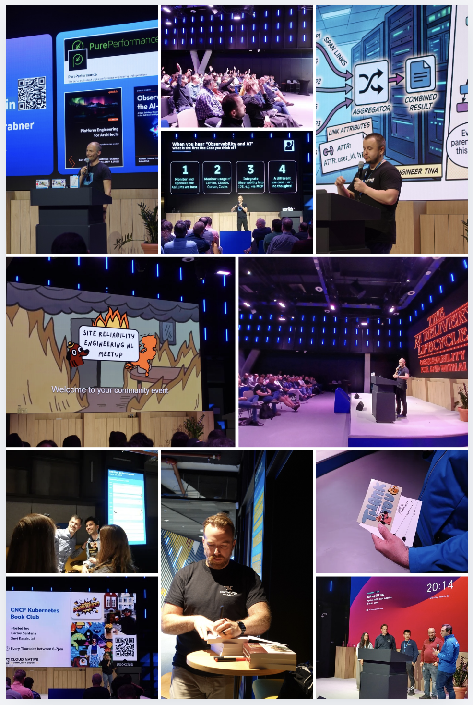

## Vitalii Likachev (Booking.com)

[Tracing for Grown-Ups: OpenTelemetry Best Practices for Large Systems](./files/tracingfor_grown_ups_opentelemetry_best_practices_for_large_systems.pdf)

## Andy Grabner (Dynatrace and CNCF Ambassador)

[PDF:Observability in the AI-Native Age ](./files/AIOBservability_Meetup_March2026_TOSHARE.pdf)

[ODP:Observability in the AI-Native Age](./files/AIOBservability_Meetup_March2026_TOSHARE.odp)
