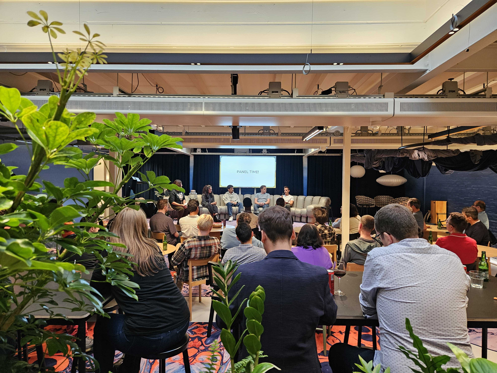

Our September Meetup at Mollie in Amsterdam brought together the community for an insightful panel
discussion on Incident Response. Moderated by Manasa Kandula from Google, the panel featured experts
Riccardo Trivellato (Gitlab), Sheela Nistala (WeTransfer), Robbert Noordzij (NS), and
Salim Bouziane Rabhi (Mollie), each sharing unique perspectives from their respective fields.

The evening concluded with a lively SRE-themed pub quiz and networking. Thanks to everyone who joined
us for this engaging and interactive event!

