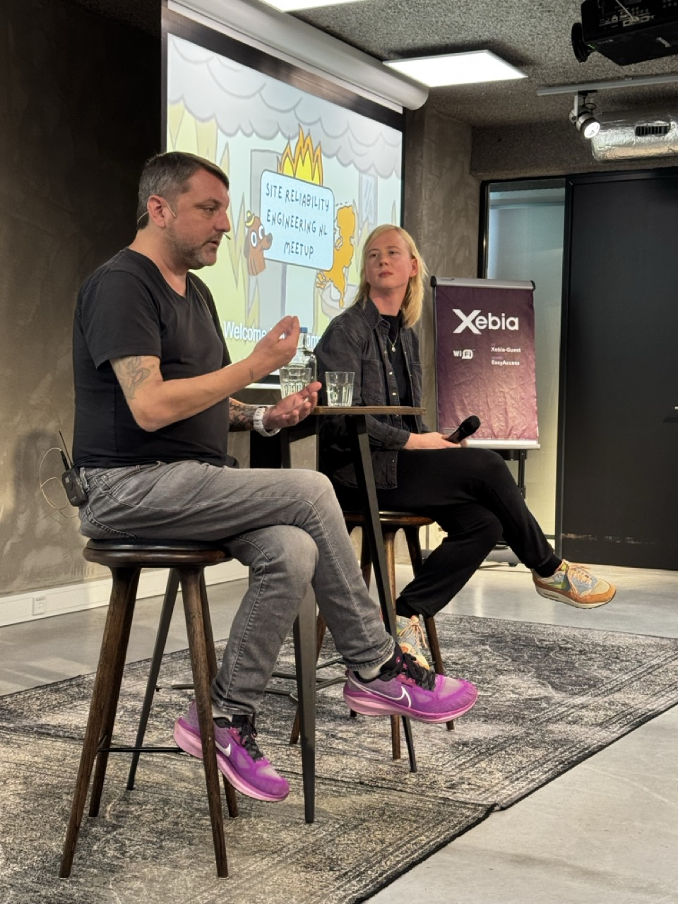

## Ehsan Khodadadi (Ayvens)

With 8 years of experience dedicated to SRE, I've come to a bold conclusion: in90% of cases, people
are the root cause of issues. It's the individuals managing products, applications, services, and
their communication that often lead to challenges and failures.

I've identified five key dimensions of human factors that I call SCORE: Skill gaps, Communication,
Organizational behavior, Record-keeping (Documentation), and Execution (Decision-making). Developing
a strong SRE culture and ensuring product resilience depend on addressing these dimensions
thoughtfully. By focusing on SCORE, we can build more reliable systems and teams.

[The human factor in tech: Unveiling the Root Cause!](./files/the-human-factor-in-sre.pdf)

## Ask Me Anything with Alex Hidalgo and Janna Brummel

Alex Hidalgo, Field CTO at Nobl9, author of the O'Reilly book Implementing Service Level Objectives
and “SRE’s Raconteur”, has developed a deep love for sustainable operations, incident response
management, proper observability, and using SLO data to drive discussions and make decisions. Alex
has a BA in philosophy from Virginia Commonwealth University. Alex's previous jobs have included SRE
functions at Google and Squarespace, but he has also worked in IT support, network security,
restaurant work, t-shirt design, and hosting game shows at bars. When not sharing his passion for
technology with others, you can find him scuba diving or watching Premier League football. To
summarize: Alex is a recognized expert in SLIs and SLOs with years of experience as an SRE.
